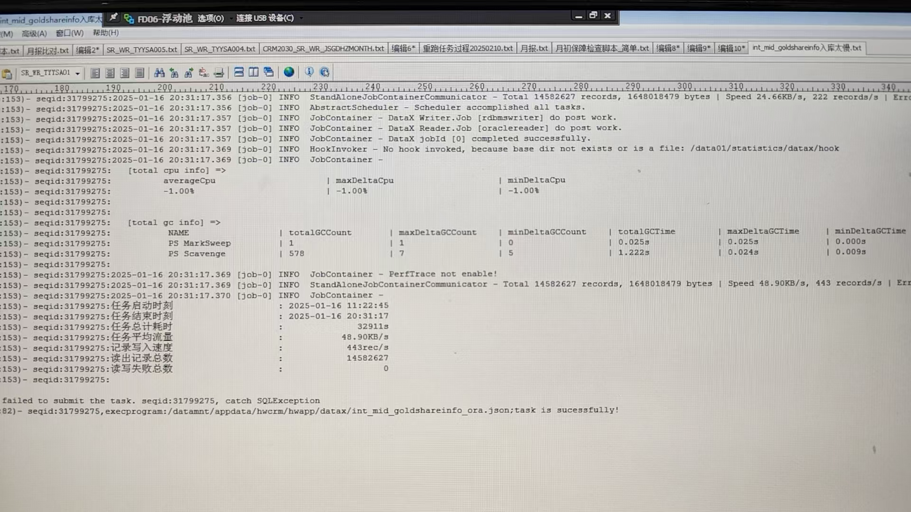

## 查看磁盘型号和序列号（与BMC信息对应）
```shell
lsblk -o NAME,SIZE,MODEL,SERIAL 
```

lsblk -d -o name,rota


## 磁盘性能优化
````shell

问题： 
客户反馈报表系统 数据库磁盘性能较差？ 如何复现即测试
客户反馈之前结算还是什么的系统，绑核后IO性能提升，不然IO一直上不去

盘维元永态反馈oracle 需要4小时，盘维+ arm要一天多的时间

测试发现： select count（1）现网oracle需要2分钟，arm+盘维需要10min

环境信息：
 BCLinux 21.10 LTS-SP2
 kunpeng 5250 48*4
 raid卡 MR9560-8i
 磁盘 SATA SSD固态盘  samsung MZ7L31T9HBLT-00B7C  (3*1.92T 做的raid5 )
 /data /data1目录 存储在sda和sdb , 使用量大概在40%-60%
 ping 网络时延 在0.08ms

可能的问题： 
1. 有个mpath问题
fio -filename=/dev/sda -direct=1 -iodepth 1 -thread -rw=read -ioengine=psync -bs=16k -size=4G -numjobs=10 -runtime=300 -group_reporting -name=mytest
fio -filename=/dev/sda -direct=1 -iodepth 1 -thread -rw=write -ioengine=psync -bs=16k -size=4G -numjobs=10 -runtime=60 -group_reporting -name=mytest -allow_mounted_write=1
fio -filename=/dev/sda -direct=1 -iodepth 1 -thread -rw=randwrite -ioengine=psync -bs=16k -size=4G -numjobs=10 -runtime=60 -group_reporting -name=mytest -allow_mounted_write=1

  181的sda fio 顺序读性能IOPS=76.7K BW=1198MB/s
  sda顺序写 93.9K 1467MB
  sda随机写 45.7K 715MB

2. raid 缓存开启
https://www.hikunpeng.com/document/detail/zh/kunpengbds/ecosystemEnable/Hive/kunpenghivehdpeu_05_0009.html
3. 调度策略deadline， 是否可以修改为none，因为磁盘为固态盘  
  
4. NUMA balancing 


问题： 可能有单核瓶颈，多个核cpu使用率100% ，但是网络和硬盘使用率都很低

业务侧能否提升并发来利用多核到性能。
采集业务需要先筛选数据，并在盘维数据库进行delete，后再到现网查询相关记录insert到盘维


12日： 报表系统采集5分13秒 ， 鲲鹏要9小时
优化1 ： sql添加/*+ set(query_dop 8) */    ps. select /*+ set(query_dop 8) */ from table where 
调优效果： 1小时50分钟，性能提升491%
分析： 
场景： 数据都是从业务库查询数据，然后插入到磐维数据库/现网oracle库

waitWriterTime 6400s 大约为1小时40分钟
BIOS配置 性能模式开启/CPU预取打开/内存刷新率32ms/Numa 打开/
cat /proc/cmdline 没有配置nohz


````


### 读IO
1. read_ahead影响：调大read_ahead_kb可以提高顺序读性能
配置方法： echo 4096 > /sys/block/sdb/queue/read_ahead_kb
```shell
   read_ahead_kb = 128
   顺序读 read: IOPS=9248, BW=145MiB/s
   随机读 read: IOPS=657, BW=10.3MiB/s
   
   read_ahead_kb = 4096
   顺序读 read: IOPS=9301, BW=145MiB/s
   随机读 read: IOPS=656, BW=10.3MiB/s
```

### 写IO

### 读写均优化
1. 磁盘IO调度方式： 优化磁盘读写性能

```shell
  顺序读 
  随机读 

  顺序读 read: IOPS=9301, BW=145MiB/s
  随机读 read: IOPS=656, BW=10.3MiB/s
   
   
```


