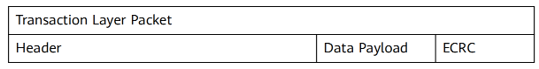

## PCIe Max Payload Size
### 目的

> [!IMPORTANT]
> 
> PCIe Max Payload Size 调大到512B（默认128B【不同设备不一样】）能在大块数据传输中增加TLP中Data Payload的大小，提高PCIe带宽的利用率。
> 
> 适合场景：大块数据传输场景（提升传输效率）
> 
> 不适合场景：低时延场景和低带宽应用（可能增加不必要的时延：增加的数据量可能会导致链路和设备的处理负担增加，从而导致整体传输的时延） 

TLP（Transaction Layer Packet）是 PCIe 协议中的一种数据包，它用于在不同设备之间传输数据。TLP 的传输和拆分受 Max Payload Size 限制，但并不是直接等待达到 Max Payload Size 后再传输。


### 方法
需要根据Port对应的设备来决定是否调整Max Payload Size （PCIe插槽可能链接显卡、硬盘和网卡等）
1.	服务器重启，进入BIOS，依次选择”BIOS -> Max Payload Size”
2.	设置“ Max Payload Size”选项为“512B”，按F10保存BIOS配置。

## 网卡中断绑核

### 目的

> [!IMPORTANT]
>
> 在网卡开启多队列时，操作系统通过Irqbalance服务来确定网卡队列中的网络数据包交
> 由哪个CPU core处理，但是当处理中断的CPU core和网卡不在一个NUMA时，会触发跨NUMA
> 访问内存。因此，我们可以将处理网卡中断的CPU core设置在网卡所在的
> NUMA上，从而减少跨NUMA的内存访问所带来的额外开销，提升网络处理性能。

### 方法

待补充（有脚本）
先修改网卡队列数 ethtool -L ethx combined 48 再绑核


## 中断聚合参数调整
增大聚合度，单个数据包的延时会有微秒级别的增加。
### 目的

> [!IMPORTANT]
>
> 中断聚合特性允许网卡收到报文之后不立即产生中断，而是等待一小段时间有更多的
报文到达之后再产生中断，这样就能让CPU一次中断处理多个报文，减少开销。
> 
> 如果是低时延场景，可以通过减小rx-usecs、rx-frames、tx-usecs、tx-frames来降低时延


### 方法
需要关闭Adaptive RX和Adaptive TX，禁用自适应调节，才能使用确保使用rx-usecs等参数配置的静态值
1. 查询
ethtool -c eth3
2. 配置
ethtool -C eth3 adaptive-rx off adaptive-tx off rx-usecs N rx-frames N tx-usecs N tx-frames N

- rx-usecs：设置接收中断延时的时间。
- tx-usecs：设置发送中断延时的时间。
- rx-frames：产生中断之前接收的数~~据包数量。
- tx-frames：产生中断之前发送的数~~据包数量。


## TSO开启
TCP Segmentation Offload
### 前提条件
要使用TSO功能，物理网卡需同时支持TCP校验计算和分散-聚集 (Scatter Gather) 功能。
查看网卡是否支持TSO：
```bash
# ethtool -k $eth
rx-checksumming: on
tx-checksumming: on
scatter-gather: on
tcp-segmentation-offload: on
```

### 目的

> [!IMPORTANT]
>
> 当一个系统需要通过网络发送一大段数据时，计算机需要将这段数据拆分为多个长度
较短的数据，以便这些数据能够通过网络中所有的网络设备，这个过程被称作分段。
TCP分段卸载将TCP的分片运算（如将要发送的1M字节的数据拆分为MTU大小的包）
交给网卡处理，无需协议栈参与，从而降低CPU的计算量和中断频率。
> 
> 操作系统直接把数据发给网卡，让网卡去拆分；而不是操作系统拆分，减少了cpu的负担

### 方法
ethtool -K $eth tso on

## 开启 LRO

### 目的

> [!IMPORTANT]
>
> LRO（Large Receive Offload），通过将接收到的多个TCP数据聚合成一个大的数据包
传递给网络协议栈处理，减少上层协议栈处理开销，提高系统接收TCP数据包的能力。
该特性在存在**大量网络小包IO**的情况下尤为明显

### 方法

1. 查看LRO是否开启
```shell
[root@hostname-kvvcy ~]# ethtool -k enp189s0f0
...
large-receive-offload: off [fixed]
```

2. 
ethtool -K $eth lro on

## 单队列网卡中断散列 （软件层实现多队列）
RPS全称是Receive Packet Steering，从Linux内核版本2.6.35开始引入。
### 目的

> [!IMPORTANT]
> 
> RPS采用软件
模拟的方式，实现了多队列网卡所提供的功能，分散了在多CPU系统上数据接收时的
负载，把软中断分到各个CPU处理，而不需要硬件支持，大大提高了网络性能。
对单队列网卡可以使用RPS将中断分散到各个core处理，避免软中断集中到一个core导
致该core软中断过高形成性能瓶颈。

### 方法
通过直接修改网卡队列参数设置RPS，能够立即生效，无需重启服务器。
1. 修改前：
```shell
/sys/class/net/eth0/queues/rx-0/rps_cpus 0
/sys/class/net/eth0/queues/rx-0/rps_flow_cnt 0
/proc/sys/net/core/rps_sock_flow_entries 0
```

2. 修改方法：

这里以单个网卡为例说明，ff对应的是core 0-7，意思是将软中断散列到0-7个core上。如果是多
个网卡，对应的ff需要修改。将并发活动连接的最大预期数目设置为32768，是因为这个是Linux
官方内核推荐值。
```shell
# echo ff > /sys/class/net/eth0/queues/rx-0/rps_cpus
# echo 4096 > /sys/class/net/eth0/queues/rx-0/rps_flow_cnt
# echo 32768 > /proc/sys/net/core/rps_sock_flow_entries
```
## 模版

### 目的

> [!IMPORTANT]
>
>

### 方法