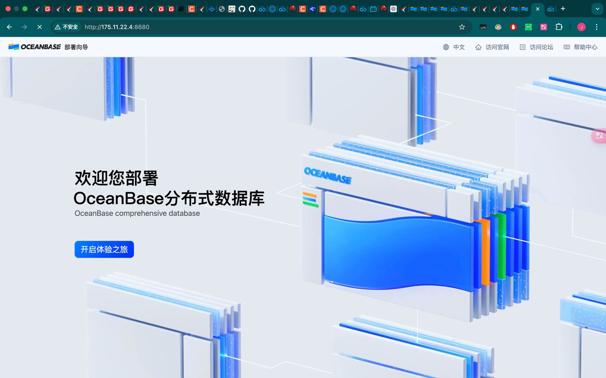
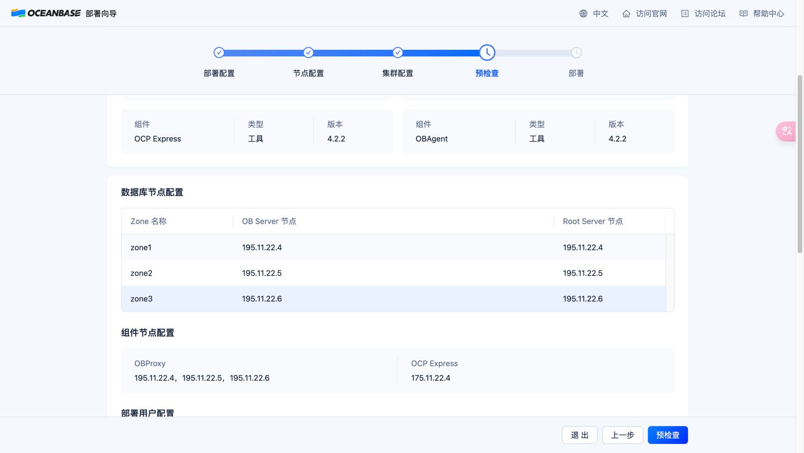
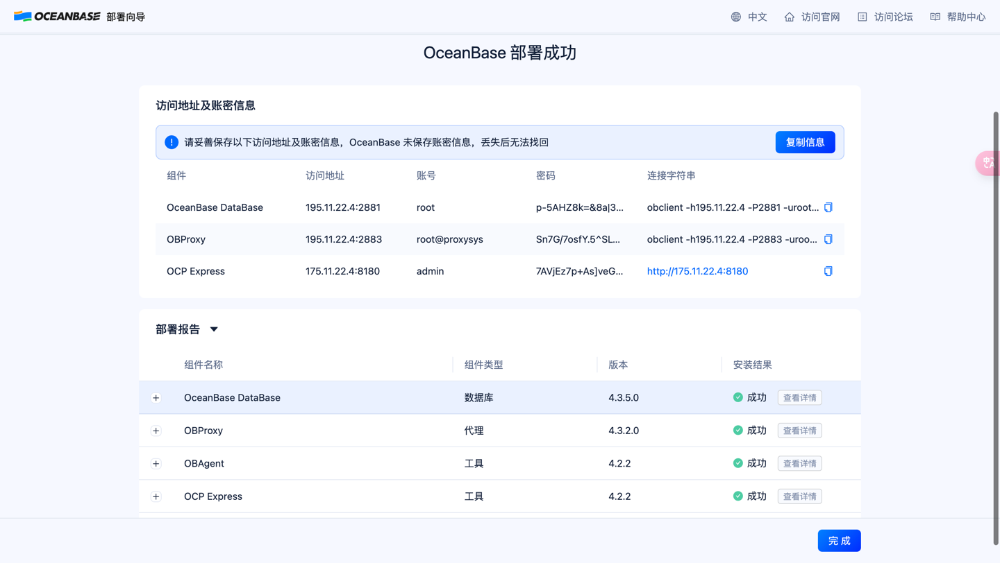
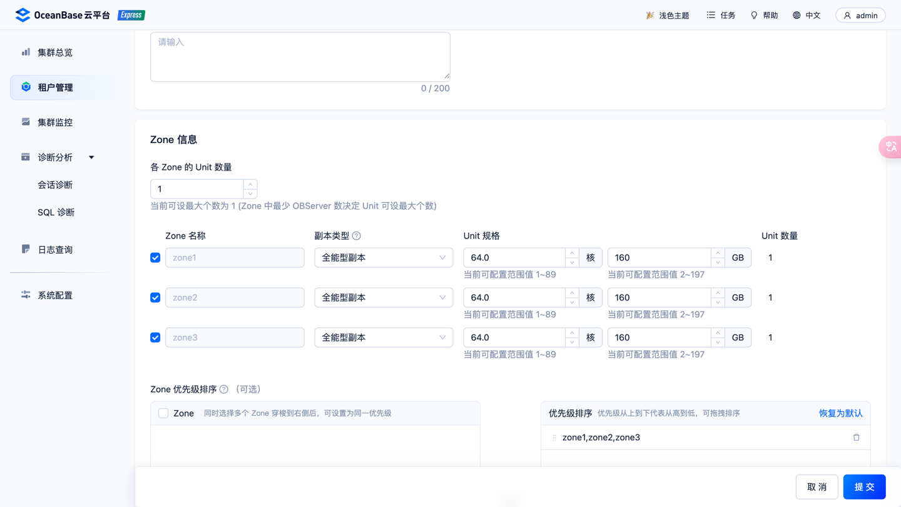

## 安装obd

```shell
bash -c "$(curl -s https://obbusiness-private.oss-cn-shanghai.aliyuncs.com/download-center/opensource/oceanbase-all-in-one/installer.sh)"
source ~/.oceanbase-all-in-one/bin/env.sh
```

## 启动obd
```shell
obd web

# 启动前请确认防火墙关闭
systemctl stop firewalld
systemctl disable firewalld
systemctl status firewalld
```



## 环境准备
````shell
# 时钟同步
yum install ntpdate -y
ntpdate ntp.aliyun.com 

# obd 检测出的需要修改的项
echo "vm.max_map_count=655360" >> /etc/sysctl.conf; sysctl -p
echo -e "* soft nofile 655350\n* hard nofile 655350" >> /etc/security/limits.d/nofile.conf

````

## 启动安装




## 部署信息保留
```shell
[
    {
        "component": "oceanbase-ce",
        "access_url": "195.11.22.4:2881",
        "user": "root",
        "password": "p-5AHZ8k=&8a|3^n/6s=1",
        "connect_url": "obclient -h195.11.22.4 -P2881 -uroot -p'p-5AHZ8k=&8a|3^n/6s=1' -Doceanbase -A"
    },
    {
        "component": "obproxy-ce",
        "access_url": "195.11.22.4:2883",
        "user": "root@proxysys",
        "password": "Sn7G/7osfY.5^SLwv]B",
        "connect_url": "obclient -h195.11.22.4 -P2883 -uroot@proxysys -p'Sn7G/7osfY.5^SLwv]B' -Doceanbase -A \n"
    },
    {
        "component": "ocp-express",
        "access_url": "175.11.22.4:8180",
        "user": "admin",
        "password": "7AVjEz7p+As]veGk8dbZ",
        "connect_url": "http://175.11.22.4:8180"
    }
]
```

## 新建sysbench租户和数据库sysbench
密码
-|CG4[)4T-B3)#Epd%?


## 